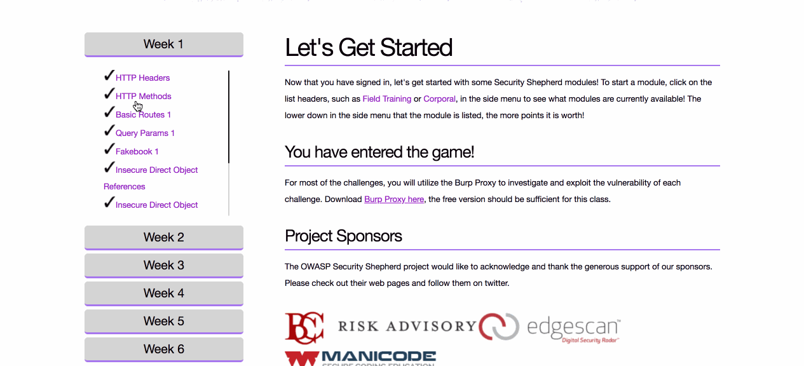

# TPM Web Security Prework

Time spent: **8** hours spent in total

- [x]	HTTP Headers

- [x]	HTTP Methods

- [x] Basic Routes 1

- [x] Query Params 1

- [x] Fakebook 1

- [x] Insecure Direct Object References

- [x] Insecure Direct Object Reference Challenge 1

- [x] Insecure Direct Object Reference Challenge 2

- [ ] Insecure Direct Object Reference Bank

# Issues
Had a hard time finding any account number for IDOR Bank Challenge with any money. I ran an intruder payload for up to 25,000 account numbers sequentially from 1 - 25,000 and still didn't find the account number for the last challenge. Other than that, everything was smooth.

# Video Submission
TPM Prework Video Summary
https://www.youtube.com/watch?v=2dbApC7v1A4

Installing Burp on Mac OS X
https://www.youtube.com/watch?v=sGO74Qs-X4g

FULL Security Shepherd Week 1 Walkthroughs (except for IDOR Bank)
https://youtu.be/2bEAXiV5ZIo
